# Hardening Password-Restricted Video Access in CinemataCMS

**Document type:** Technical Whitepaper
**Date:** March 27, 2026
**Status:** Draft
**Related plan:** [Implementation Plan](../plans/2026-03-26-001-feat-harden-password-restricted-video-plan.md)

---

## Table of Contents

1. [Introduction](#1-introduction)
2. [Background](#2-background)
3. [Problem Statement](#3-problem-statement)
   - 3.1 [Plaintext Password Storage](#31-plaintext-password-storage)
   - 3.2 [Password Leakage to the Frontend](#32-password-leakage-to-the-frontend)
   - 3.3 [Passwords Exposed in URLs](#33-passwords-exposed-in-urls)
   - 3.4 [No Protection Against Brute-Force Attacks](#34-no-protection-against-brute-force-attacks)
   - 3.5 [Broken Embed Authentication](#35-broken-embed-authentication)
   - 3.6 [Expensive Per-Request Computation](#36-expensive-per-request-computation)
4. [Solution Overview](#4-solution-overview)
5. [Design Details](#5-design-details)
   - 5.1 [Password Hashing at Rest](#51-password-hashing-at-rest)
   - 5.2 [Token-Based Access](#52-token-based-access)
   - 5.3 [HLS Manifest Rewriting](#53-hls-manifest-rewriting)
   - 5.4 [Rate Limiting](#54-rate-limiting)
   - 5.5 [Embed Authentication](#55-embed-authentication)
   - 5.6 [Password Validation](#56-password-validation)
6. [Architecture](#6-architecture)
   - 6.1 [Password Entry Flow](#61-password-entry-flow)
   - 6.2 [Token Validation Flow](#62-token-validation-flow)
   - 6.3 [HLS Streaming with Token Auth](#63-hls-streaming-with-token-auth)
   - 6.4 [Token Invalidation on Password Change](#64-token-invalidation-on-password-change)
   - 6.5 [System Component Overview](#65-system-component-overview)
7. [Scope and Limitations](#7-scope-and-limitations)
8. [Rollout Strategy](#8-rollout-strategy)
9. [Risk Considerations](#9-risk-considerations)
10. [Effort Estimation](#10-effort-estimation)
    - 10.1 [T-Shirt Sizing by Unit](#101-t-shirt-sizing-by-unit)
    - 10.2 [Estimated Timeline](#102-estimated-timeline)
    - 10.3 [Overall Summary](#103-overall-summary)
11. [Conclusion](#11-conclusion)

---

## 1. Introduction

CinemataCMS provides a feature that lets content creators password-protect their videos. This is especially valuable for filmmakers who need to share sensitive or unreleased work with a limited audience, such as festival judges, collaborators, or private communities.

While this feature is well-loved by creators, the way it works under the hood has several security weaknesses. Passwords are stored in plain text, passed through URLs, and leaked into the page source. There is no protection against someone repeatedly guessing passwords, and the embedded player for restricted videos simply does not work.

This whitepaper describes the problems in detail, then walks through a redesigned approach that replaces plaintext passwords with hashed storage, introduces short-lived access tokens, adds brute-force protection, and fixes embed authentication. The goal is to bring this feature up to a level of security that content creators can trust with confidence.

## 2. Background

CinemataCMS is a Django-based video content management system built for Asia-Pacific social issue filmmaking. It supports video hosting, adaptive streaming via HLS, and a React-based frontend.

One of its features allows creators to set a password on individual videos. When a viewer visits that video's page, they see a password prompt. If they enter the correct password, the video plays. This "shared password" model is simple and works well for the use case of controlled sharing without requiring viewers to create accounts.

The feature was originally implemented with a straightforward approach: store the password as plain text, compare it directly when the viewer submits the form, and pass it along through URLs so that every subsequent request (API calls, video segments, thumbnails) can also verify access. While this gets the job done functionally, it introduces several security concerns that this project aims to resolve.

## 3. Problem Statement

### 3.1. Plaintext Password Storage

Media passwords are stored as plain text in the database. If the database is ever compromised through a breach, backup leak, or unauthorized access, every restricted video's password is immediately visible. Industry best practice is to store only a one-way hash of the password so that the original value cannot be recovered.

### 3.2. Password Leakage to the Frontend

When a viewer successfully enters the correct password, the server injects the plaintext password directly into the HTML page using Django's `json_script` template tag. This means anyone who views the page source can read the password. It is also accessible to browser extensions, injected scripts, and any JavaScript running on the page.

### 3.3. Passwords Exposed in URLs

After authentication, the plaintext password is appended to every URL as a query parameter (`?password=secretvalue`). This affects API calls, video segment requests, thumbnail fetches, and internal navigation links. URLs with passwords in them can end up in:

- Browser history
- Server access logs (both application and NGINX)
- HTTP Referer headers sent to third-party services
- Network monitoring tools and proxy logs

This is one of the most widely recognized anti-patterns in web security.

### 3.4. No Protection Against Brute-Force Attacks

There is no rate limiting on password attempts. An attacker can submit unlimited guesses against a restricted video's password form with no lockout, delay, or logging. Given enough time and a simple script, short or common passwords can be discovered through repeated trial.

### 3.5. Broken Embed Authentication

The embed view, which allows restricted videos to be embedded in external websites via an iframe, performs no authentication at all. It does not check for a password or any other credential. In practice, this means embedded restricted videos either fail silently or are completely inaccessible through the embed path.

### 3.6. Expensive Per-Request Computation

One of the three verification code paths computes a PBKDF2 hash with 600,000 iterations on every single request. For HLS video streaming, this means the hash is recalculated for every 4-second video segment. This creates unnecessary CPU load and adds latency to video playback, particularly under high concurrency.

## 4. Solution Overview

The solution replaces the plaintext password mechanism with a three-part approach:

1. **Hash passwords at rest.** Store passwords using Django's standard password hashing utilities (PBKDF2 by default). The original plaintext is never stored, and existing passwords are migrated in a one-time database operation.

2. **Issue short-lived access tokens.** When a viewer enters the correct password, the server generates a random, opaque token and stores it in Redis with a configurable time-to-live (default: 4 hours). All subsequent requests use this token instead of the password. The token proves that the viewer has already been authenticated without revealing the password itself.

3. **Add brute-force rate limiting.** Track failed password attempts per IP address and media item using a Redis counter. After a configurable number of failures (default: 5 within 15 minutes), further attempts are temporarily blocked.

These changes are complemented by fixes to embed authentication, removal of all plaintext password references from the frontend, and server-side HLS manifest rewriting to ensure token-based auth works across all browsers and devices, including Safari and iOS.

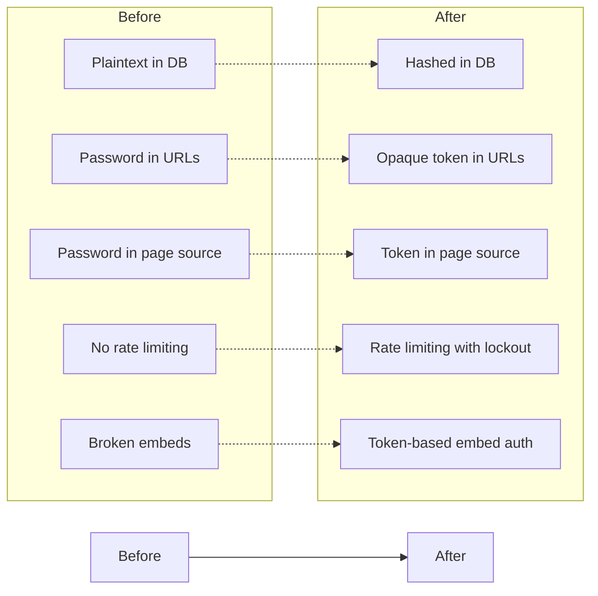

## 5. Design Details

### 5.1. Password Hashing at Rest

Media passwords will be hashed using Django's built-in `make_password()` function, which applies PBKDF2 with a random salt by default. This is the same mechanism Django uses for user account passwords.

Key aspects of the implementation:

- **Field widening.** The database column is widened from 100 to 256 characters to accommodate the longer hash strings.
- **Data migration.** A one-time migration hashes all existing plaintext passwords in the database. This operation is irreversible by design.
- **Double-hash protection.** The model's `save()` method uses Django's `identify_hasher()` to detect whether a value is already hashed before applying `make_password()`. This prevents accidental double-hashing when saving a record that has not had its password changed.
- **Single entry point.** A `set_password()` method is added to the Media model, following the same pattern as Django's `User.set_password()`. All code paths that set a password must go through this method.

Verification at login time uses Django's `check_password()`, which handles salt extraction and hash comparison internally.

### 5.2. Token-Based Access

Once a viewer enters the correct password, the server generates a cryptographically secure random token using Python's `secrets.token_urlsafe(32)`, producing a 256-bit value. This token replaces the password in all subsequent interactions.

The token is stored in Redis using a dual-key structure:

| Key | Value | Purpose |
|-----|-------|---------|
| `cinemata_media_token:access:{token}` | `{media_id, created_at}` | Token lookup and validation |
| `cinemata_media_token:media:{media_id}` | Set of active token keys | Per-media invalidation |

The lookup key has a configurable TTL (default: 4 hours). When a token is presented in a request, the server looks it up in Redis, confirms that the `media_id` matches the requested content, and grants or denies access accordingly.

If Redis is unavailable, token validation fails closed, meaning access to restricted content is denied. Content owners and editors are checked before token validation, so they remain unaffected by Redis outages.

The token is also stored in the viewer's session, so returning visitors do not need to re-enter the password until the token expires.

### 5.3. HLS Manifest Rewriting

HLS (HTTP Live Streaming) works by delivering a manifest file (`.m3u8`) that lists the URLs of individual video segments. The video player fetches these segments one at a time during playback.

For token-based authentication to work with HLS, every segment URL in the manifest must include the access token. The solution uses server-side manifest rewriting: when a viewer requests a manifest, the server reads the file, appends `?token=...` to every segment and variant playlist URL, and returns the modified manifest.

This approach is the industry standard, used by Mux, Cloudflare Stream, and AWS CloudFront, among others. It works universally across all browsers and devices, including Safari and iOS, which use their native HLS implementation and bypass any JavaScript-based hooks.

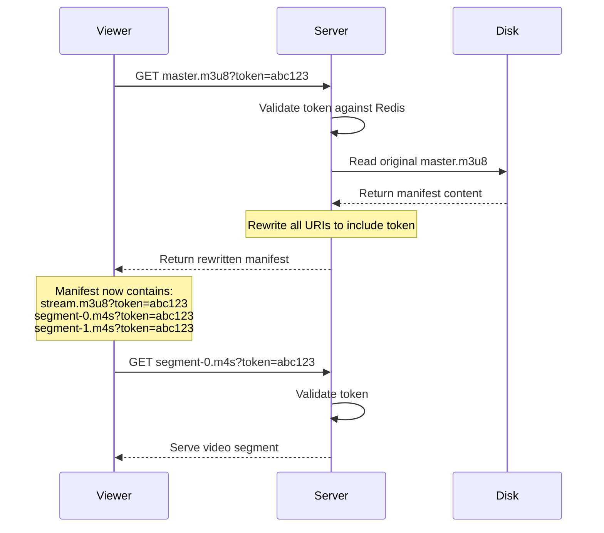

Server-side manifest rewriting is the sole mechanism for HLS segment authentication. Earlier designs considered a JavaScript-level hook in the video player as a fallback, but this was dropped because Safari and iOS bypass the JavaScript player entirely for HLS, making it unreliable. By handling everything on the server, the solution works consistently across all browsers and devices without any client-side workarounds.

### 5.4. Rate Limiting

Brute-force protection is implemented using a Redis-based counter, scoped to the combination of the viewer's IP address and the specific media item. Each failed password attempt increments the counter.

| Setting | Default | Description |
|---------|---------|-------------|
| `PASSWORD_BRUTE_FORCE_MAX_ATTEMPTS` | 5 | Maximum failed attempts before lockout |
| `PASSWORD_BRUTE_FORCE_WINDOW` | 900 (15 min) | Lockout duration in seconds |

When the counter reaches the maximum, all further attempts from that IP for that media item are rejected with an HTTP 429 (Too Many Requests) response until the window expires. Failed attempts are logged for auditing.

The rate limiter checks happen before password verification, so a locked-out IP does not trigger any hashing computation.

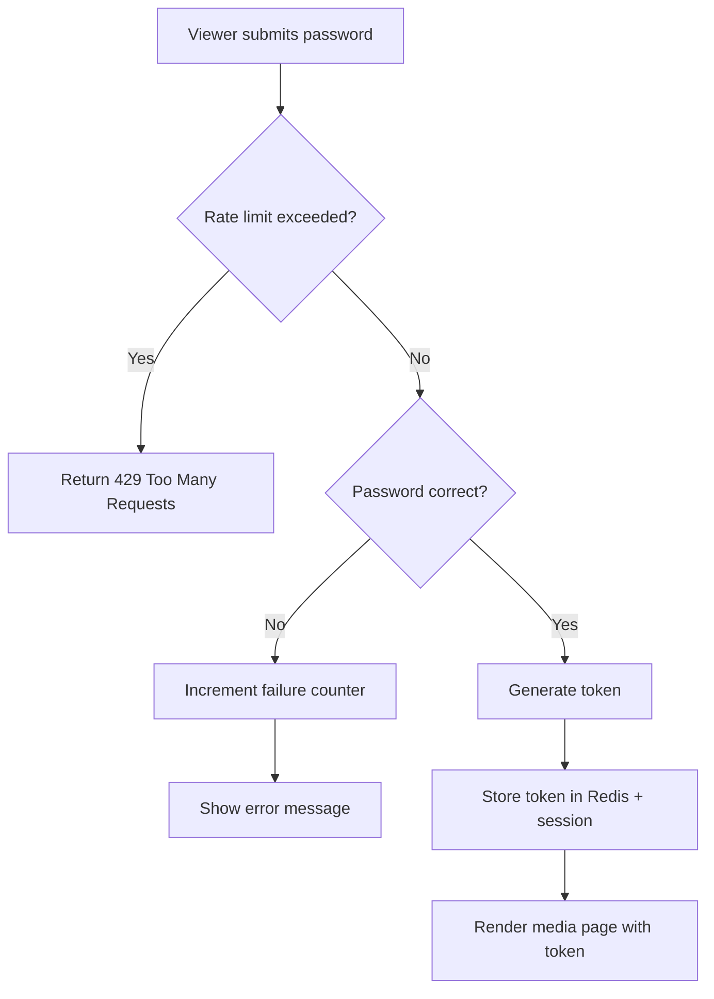

### 5.5. Embed Authentication

The embed view is updated to accept a `?token=` query parameter. When a restricted video is embedded on an external site, the embed URL must include a valid access token.

The flow works as follows:

1. A creator or authorized viewer obtains a token by entering the password on the main media page.
2. The embed URL is constructed with the token: `https://example.com/embed/abc123?token=xyz`.
3. When the iframe loads, the server validates the token and renders the embedded player if valid.
4. If the token is missing or invalid, the server returns a 401 response.

Because tokens expire (default: 4 hours), embed URLs are not permanent. This is an accepted limitation for this phase. Viewers who need ongoing access can re-authenticate on the main media page to obtain a fresh token.

### 5.6. Password Validation

A configurable minimum password length (default: 8 characters) is enforced when creators set or change a password for restricted media. This helps prevent trivially guessable passwords. The validation runs on the plaintext input before hashing, through the normal media edit form.

## 6. Architecture

### 6.1. Password Entry Flow

This diagram shows what happens when a viewer visits a restricted video page and submits the password.

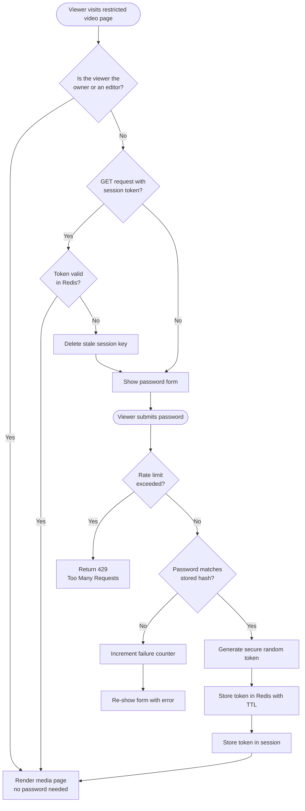

### 6.2. Token Validation Flow

All three server-side code paths (the page view, the REST API, and the file-serving layer) converge on the same token validation logic.

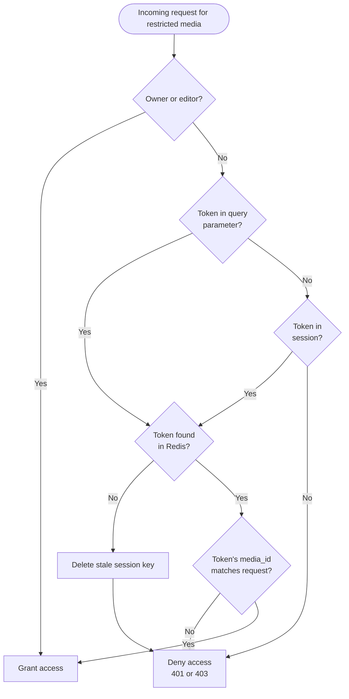

### 6.3. HLS Streaming with Token Auth

This shows the full lifecycle of a restricted video playback session, from password entry through HLS segment delivery.

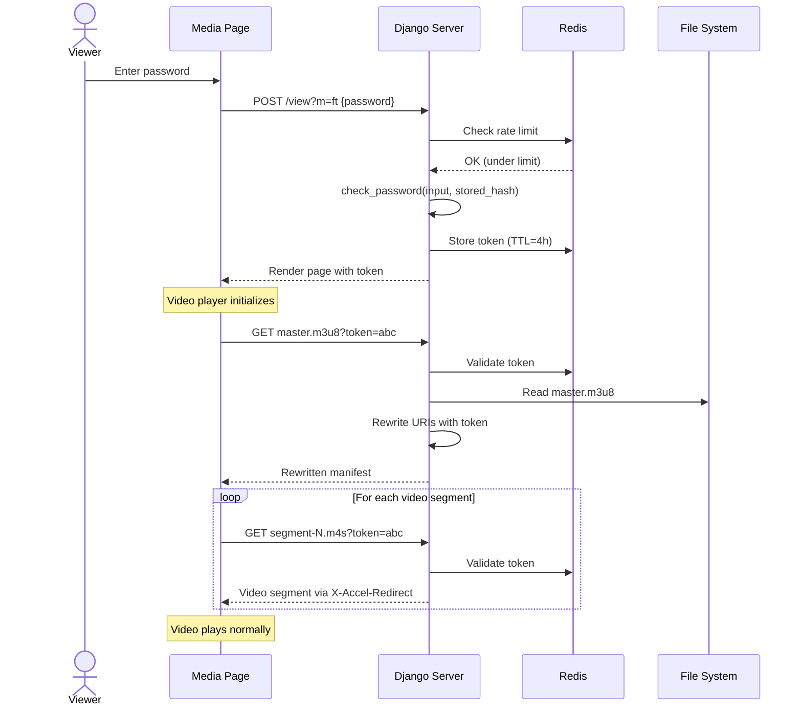

### 6.4. Token Invalidation on Password Change

When a creator changes the password on a restricted video, all existing access tokens for that video are revoked immediately. Viewers who are currently watching will need to re-authenticate with the new password.

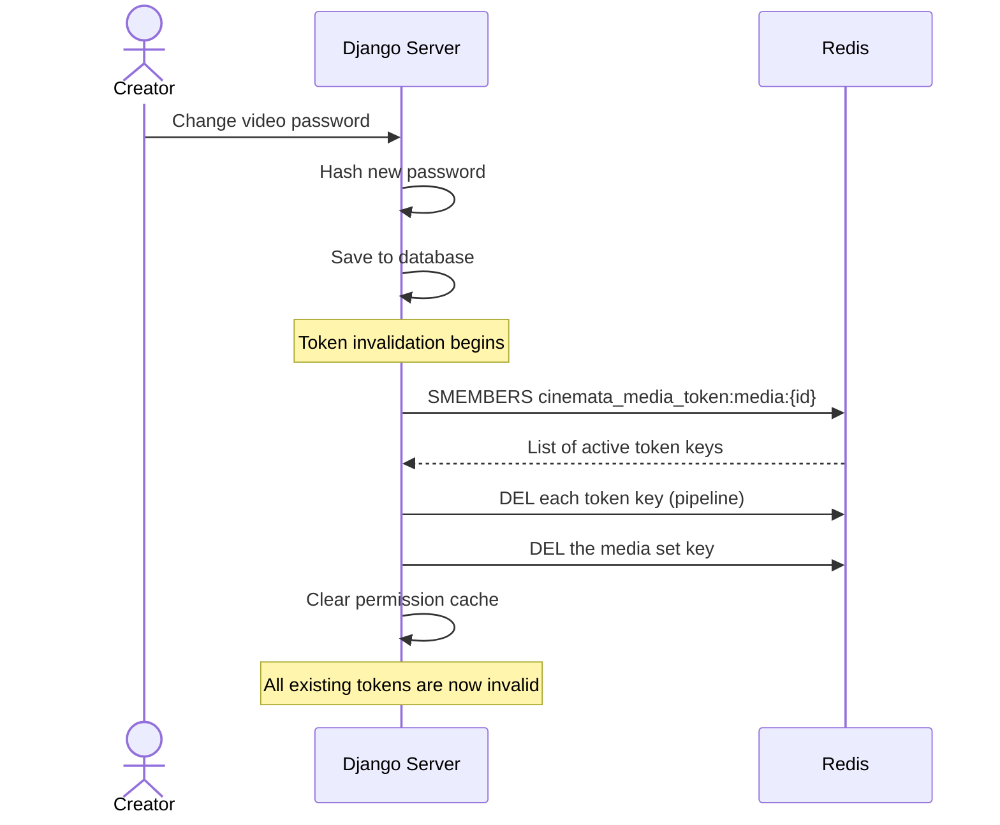

### 6.5. System Component Overview

A high-level view of how the components interact in the new design.

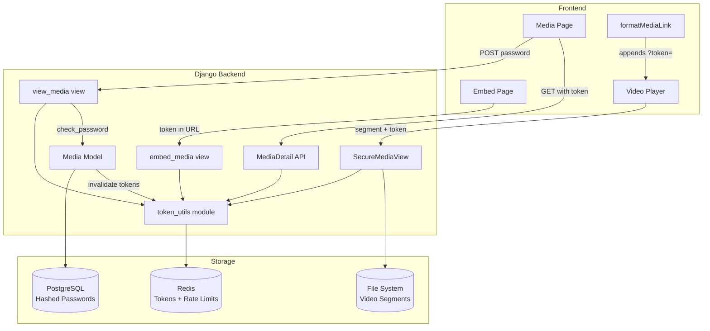

## 7. Scope and Limitations

This project focuses specifically on hardening the existing shared-password mechanism. Several things are intentionally out of scope:

1. **No change to the user experience.** Viewers still see a password form on the media page and enter the password to watch. The interaction feels the same; only the underlying mechanics change.

2. **No user-level access control.** This remains a shared-password model, not a per-user permission system. Anyone with the correct password gets access.

3. **No token refresh.** Tokens expire after the configured TTL. There is no automatic renewal. Viewers whose tokens expire during a long session will need to re-enter the password.

4. **No AES-256 encrypted HLS.** The token architecture is designed to support encrypted HLS segments in the future, but encryption is not implemented in this phase.

5. **No NGINX log scrubbing.** Tokens may appear in NGINX access logs as query parameters. This is an accepted residual risk. Tokens are short-lived and opaque, which limits the impact.

6. **No IP or device binding for tokens.** Tokens are not tied to a specific IP address or browser. A token could theoretically be shared, but its short lifespan limits the window of exposure.

7. **Embed URL lifespan.** Embed URLs that include a token will stop working after the token expires (default: 4 hours). Long-lived embed codes are not supported in this phase.

## 8. Rollout Strategy

The work is organized into two pull requests, ordered by priority:

### 8.1. PR #1: Core Security Hardening (Priority 0)

This pull request covers the critical security improvements:

| Unit | Description |
|------|-------------|
| 1 | Settings constants and the token/rate-limit utility module |
| 2 | Model password hashing, the `set_password()` method, and the data migration |
| 3 | Backend view updates for all three code paths, plus embed auth |
| 4 | Template updates to remove plaintext and inject tokens |
| 5 | Frontend changes across all components to use tokens |
| 6 | Integration and regression tests covering the full flow |

### 8.2. PR #2: Password Validation (Priority 1)

This pull request adds password quality enforcement on top of PR #1:

| Unit | Description |
|------|-------------|
| 7 | Minimum password length validation on the media form |

### 8.3. Deployment Considerations

- **Database migration.** The data migration that hashes existing passwords is irreversible. It should be tested against a copy of the production database before running in production, and scheduled during a maintenance window.
- **Active session disruption.** Viewers currently watching restricted videos will have their sessions interrupted when the new code deploys. The old session-based password keys are gracefully ignored by the new code, but viewers will need to re-enter the password to obtain a token. Deploying during a low-traffic period is recommended.

## 9. Risk Considerations

| Risk | Likelihood | Impact | Mitigation |
|------|-----------|--------|------------|
| Data migration corrupts passwords | Low | High | Test on DB copy first. The `identify_hasher()` guard prevents double-hashing. |
| Redis outage blocks restricted media | Low | Medium | Redis is already critical infrastructure (cache + sessions). Owner/editor bypass is unaffected. Fail-closed is the correct behavior for a security system. |
| Token expiration during long playback | Medium | Low | Custom error message tells the viewer to refresh and re-enter the password. |
| Embed URLs expire after 4 hours | Medium | Low | Documented limitation. Future work could add in-iframe password forms. |
| Brute-force via distributed IPs | Low | Low | Rate limiting per IP provides meaningful protection for the threat model. Advanced attackers with botnets are unlikely to target individual video passwords. |

## 10. Effort Estimation

### 10.1. T-Shirt Sizing by Unit

The table below provides a rough sense of the relative size and complexity of each implementation unit. Sizing reflects the amount of code to write, the number of files touched, the level of care required (for example, data migrations), and the breadth of test coverage needed.

| Size | What it means |
|------|---------------|
| **S** (Small) | Narrow scope, few files, straightforward patterns. Typically a day or less. |
| **M** (Medium) | Multiple concerns or files, moderate test coverage, some careful reasoning needed. A few days of focused work. |
| **L** (Large) | Wide blast radius, many files and code paths, extensive testing, higher coordination needs. Several days to a week. |

#### PR #1: Core Security Hardening

| Unit | Description | Size | Rationale |
|------|-------------|------|-----------|
| 1 | Settings and token/rate-limit utility module | **M** | New module with multiple responsibilities (token lifecycle, rate limiting, manifest rewriting), each needing its own test coverage. Self-contained, but there is meaningful logic to get right. |
| 2 | Model password hashing and data migration | **M** | Focused scope (model layer only), but the data migration is irreversible and needs careful testing. The double-hash guard and `set_password()` method require precision. |
| 3 | Backend views, templates, and manifest rewriting | **L** | The largest unit. Three separate verification code paths need to be rewritten, plus template updates, embed auth, and server-side HLS manifest rewriting. Many test scenarios to cover. |
| 4 | Frontend token propagation | **M** | Touches seven component files, but most changes follow the same pattern: replace `password` references with `token`. The ImageViewer fix and the embed page integration require a bit more thought. |
| 5 | Integration and regression tests | **S** | No production code changes. Focused on writing end-to-end tests that exercise the full flow across units. Benefits from test helpers already created in earlier units. |

#### PR #2: Password Validation

| Unit | Description | Size | Rationale |
|------|-------------|------|-----------|
| 6 | Password complexity validation | **S** | A single `clean_password()` method on the form, plus a few test cases. Minimal scope. |

### 10.2. Estimated Timeline

Two timelines are provided below: one for a developer working manually, and one for a developer working with AI-assisted tooling such as Claude Code.

#### Manual Development

These estimates assume a single developer who is familiar with the codebase, working without major interruptions. They include writing code, tests, and self-review, but not code review by others or deployment.

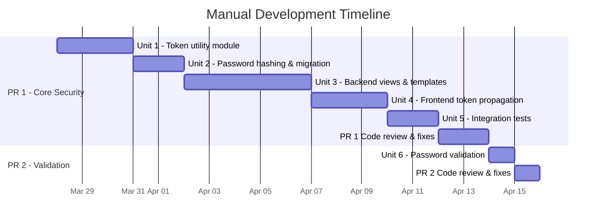

| Phase | Units | Estimated Duration |
|-------|-------|--------------------|
| PR #1: Core Security Hardening | Units 1 through 5 | ~3 weeks (15 working days) |
| PR #1: Code review and fixes | - | ~2 days |
| PR #2: Password Validation | Unit 6 | ~1 day |
| PR #2: Code review and fixes | - | ~1 day |
| **Total** | **All units** | **~4 weeks (19 working days)** |

#### AI-Assisted Development (Claude Code)

With AI-assisted tooling, the developer focuses on direction, review, and verification while the AI handles scaffolding, boilerplate, repetitive edits, and test generation. The time savings vary by task type:

- **Scaffolding and boilerplate** (utility modules, settings, forms) speed up significantly. The AI can generate well-structured code from the plan description with minimal back-and-forth.
- **Repetitive cross-file changes** (frontend token propagation across seven components) are where AI assistance shines the most. Pattern-based find-and-replace across many files can be done in one pass.
- **Test writing** is faster because the AI can generate comprehensive test cases from the plan's test scenarios directly.
- **Complex logic** (view rewrites, manifest rewriting, data migration) still needs careful human review. The AI writes the code quickly, but the developer must verify correctness, especially for security-critical paths.
- **Data migration testing** remains a manual task. Running the migration against a database copy and verifying results cannot be shortcut.
- **Code review** stays roughly the same. Reviewers still need to read and understand the changes.

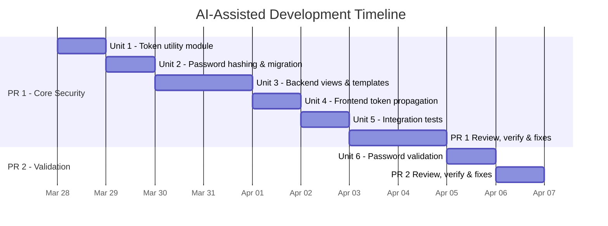

| Phase | Units | Manual | AI-Assisted |
|-------|-------|--------|-------------|
| PR #1: Core Security Hardening | Units 1 through 5 | ~15 days | ~6 days |
| PR #1: Review, verify, and fixes | - | ~2 days | ~2 days |
| PR #2: Password Validation | Unit 6 | ~1 day | ~0.5 day |
| PR #2: Review, verify, and fixes | - | ~1 day | ~1 day |
| **Total** | **All units** | **~4 weeks (19 days)** | **~2 weeks (9.5 days)** |

#### Per-Unit Comparison

| Unit | Description | Manual | AI-Assisted | What the AI helps with |
|------|-------------|--------|-------------|------------------------|
| 1 | Token utility module | 3 days | 1 day | Scaffolds the module, generates Redis operations, writes all test cases from the plan |
| 2 | Password hashing and migration | 2 days | 1 day | Generates migration files, writes `set_password()` and save guard, generates test matrix |
| 3 | Backend views and templates | 5 days | 2 days | Rewrites three code paths in parallel, updates templates, writes the extensive test suite |
| 4 | Frontend token propagation | 3 days | 1 day | Applies the same rename pattern across seven files in one pass, catches all references |
| 5 | Integration tests | 2 days | 1 day | Generates end-to-end test scenarios directly from the plan's verification checklist |
| 6 | Password validation | 1 day | 0.5 day | Simple form validation, trivial for AI to scaffold |

> **Note:** AI-assisted estimates assume the developer is actively reviewing AI output, running tests after each unit, and manually verifying the data migration. The time savings come from faster code generation and reduced context-switching, not from skipping verification steps.

### 10.3. Overall Summary

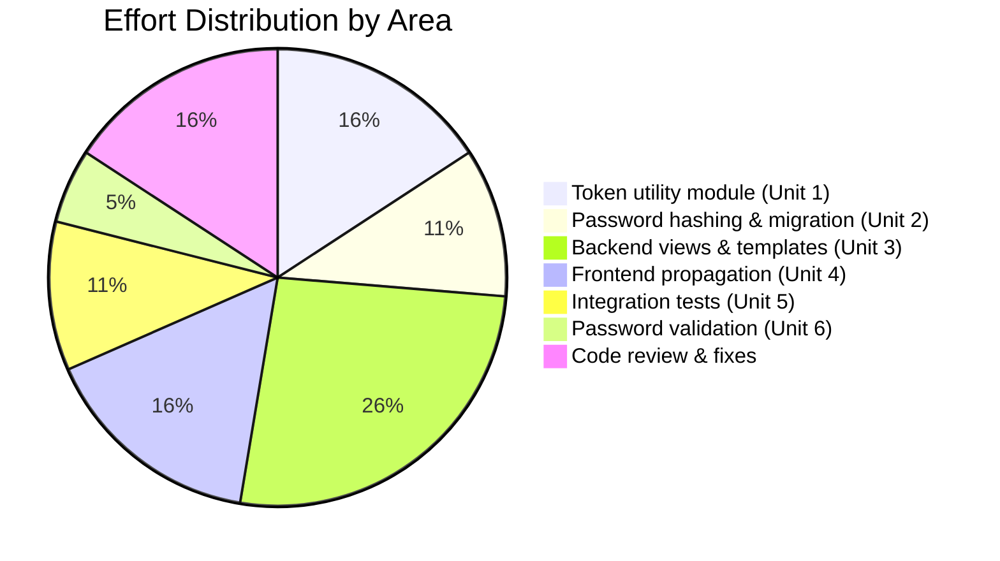

The bulk of the effort sits in Unit 3, which rewrites the three backend verification code paths and adds HLS manifest rewriting. This is where most of the security-critical logic lives, and where the most thorough testing is needed.

Units 1 and 2 lay the foundation. They are medium-sized but require careful work because errors in token management or the data migration would affect everything downstream.

The frontend work (Unit 4) is repetitive but important. Most changes follow the same pattern across multiple components, so the risk is lower but attention to completeness matters (especially the ImageViewer fix and embed page).

PR #2 is intentionally lightweight, allowing the core security improvements to ship independently and quickly.

With AI-assisted development, the overall timeline shrinks from roughly 4 weeks to roughly 2 weeks. The savings are most noticeable in code generation and test writing. Review and verification time stays about the same, which is appropriate for a security-focused change.

PR #2 is now a single unit (password validation only), making it a quick follow-up that can ship shortly after PR #1.

## 11. Conclusion

The current password-restricted video mechanism in CinemataCMS has several security weaknesses that could put creators' content at risk. Plaintext storage, URL leakage, and missing rate limiting are the most pressing concerns.

The proposed solution addresses all of these issues through a combination of password hashing, opaque access tokens, server-side manifest rewriting, and brute-force rate limiting. The design follows industry standards and builds on patterns already established in the codebase, particularly Django's own password hashing utilities and the existing Redis infrastructure.

For viewers, the experience remains the same: enter a password, watch the video. For creators, the assurance is much stronger: passwords are properly protected, access is controlled through short-lived tokens, and repeated guessing is blocked.

The work is structured into two focused pull requests, with the core security hardening delivered first and the polish delivered second. This allows the most critical improvements to reach production as quickly as possible while keeping each change set reviewable and testable.
